# Tugas Lab 4 Web
## Profil
| # | Biodata |
| -------- | --- |
| **Nama** | Muhammad Safri Satria Permana |
| **NIM** | 312010337 |
| **Kelas** | TI.20.A.2 |
| **Mata Kuliah** | Pemrograman Web |
## Langkah 1

### 1. Membuat Box Element
```html
<section>
        <div class="div1">Div 1</div>
        <div class="div2">Div 2</div>
        <div class="div3">Div 3</div>
</section>
```
CSS Float Property
```html
<style>
        div {
            float:left;
            padding: 10px;
        }
        .div1 {
            background: red;
        }
        .div2 {
            background: yellow;
        }
        .div3 {
            background: green;
        }
</style>
```
### Berikut Adalah hasilnya


### 2. Mengatur Clearfix Element
```html
<section>
        <div class="div1">Div 1</div>
        <div class="div2">Div 2</div>
        <div class="div3">Div 3</div>
        <div class="div4">Div 4</div>
</section>
<style>
        div {
            float:left;
            padding: 10px;
        }
        .div1 {
            background: red;
        }
        .div2 {
            background: yellow;
        }
        .div3 {
            background: green;
        }
        .div4 {
            background-color: blue;
            clear: left;
            float: none;
        }
</style>
```

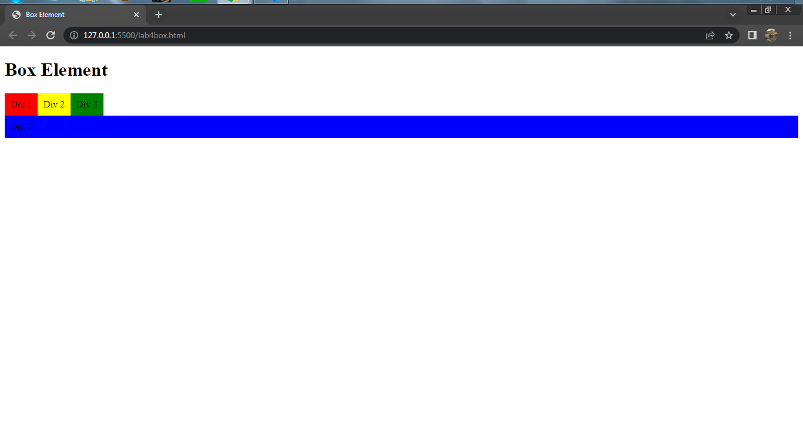

### 3. Membuat Layout Sederhana 
```html
<!DOCTYPE html>
<html lang="en">
<head>
    <meta charset="UTF-8">
    <meta http-equiv="X-UA-Compatible" content="IE=edge">
    <meta name="viewport" content="width=device-width, initial-scale=1.0">
    <title>Layout Sederhana</title>
    <link rel="stylesheet" href="style.css">
</head>
<body>
    <div id="container">
        <header>
            <h1>Layout Sederhana</h1>
        </header>
        <nav>
            <a href="home.html" class="active">Home</a>
            <a href="artikel.html">Artikel</a>
            <a href="about.html">About</a>
            <a href="kontak.html">Kontak</a>
        </nav>
        <section id="hero"></section>
        <section id="wrapper">
            <section id="main"></section>
            <aside id="sidebar"></aside>
        </section>
        <footer>
            <p>&copy; 2021 - Universitas Pelita Bangsa</p>
        </footer>
    </div>
</body>
</html>
```

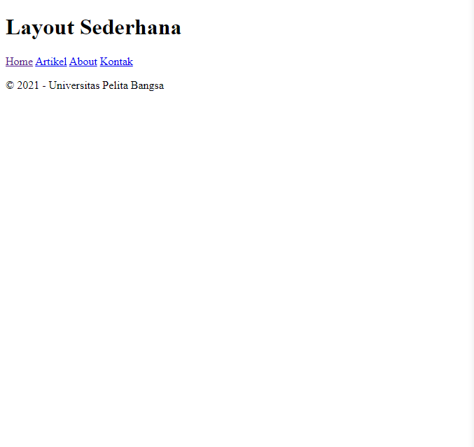

###  Menambahkan kode CSS untuk membuat layoutnya
```css
/* import google font */
@import url('https://fonts.googleapis.com/css2?family=Open+Sans:ital,wght@0,300;0,400;0,600;0,700;0,800;1,300;1,400;1,600;1,700;1,800&display=swap');
@import url('https://fonts.googleapis.com/css2?family=Open+Sans+Condensed:ital,wght@0,300;0,700;1,300&display=swap');
/* Reset CSS */ 
* {
    margin: 0;
    padding: 0;
}
body {
    line-height: 1;
    font-size: 100%;
    font-family: 'Open Sans',sans-serif;
    color: #5a5a5a;
}
#container {
    width: 980px;
    margin: 0 auto;
    box-shadow: 0 0 1em #cccccc;
}
/* header */
header {
    padding: 20px;
}
header h1 {
    margin: 20px 10px;
    color: #b5b5b5;
}
```

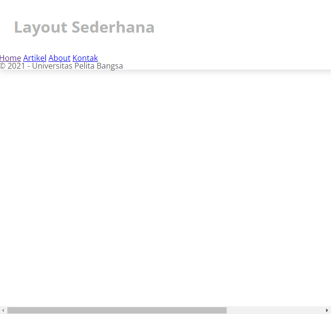

### 3. Membuat Navigasi
```css
/* navigasi */
nav {
    display: block;
    background-color: #1f5faa;
}
nav a {
    padding: 15px 30px;
    display: inline-block;
    color: #ffffff;
    font-size: 14px;
    text-decoration: none;
    font-weight: bold;
}
nav a.active,
nav a:hover {
    background-color: #2b83ea;
}
```

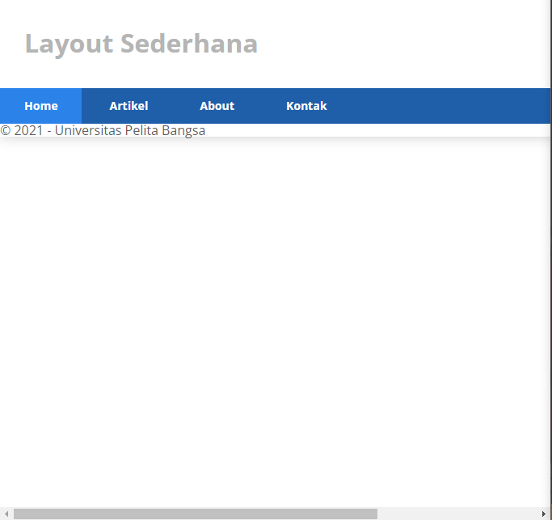

### 4. Membuat Hero Panel
```html
<section id="hero"><h1>Hello World!</h1>
    <p>Lorem ipsum dolor sit amet consectetur adipisicing elit. Tempore soluta magni, dolores veritatis commodi libero, autem ducimus perspiciatis tenetur fugit optio, similique perferendis dicta ut veniam esse animi minus dolore!</p>
    <a href="home.html" class="btn btn-large">Learn more &raquo;</a>
</section>
```
```css
/* Hero Panel */
#hero {
    background-color: #e4e4e5;
    padding: 50px 20px;
    margin-bottom: 20px;
}
#hero h1 {
    margin-bottom: 20px;
    font-size: 35px;
}
#hero p {
    margin-bottom: 20px;
    font-size: 18px;
    line-height: 25px;
}
```

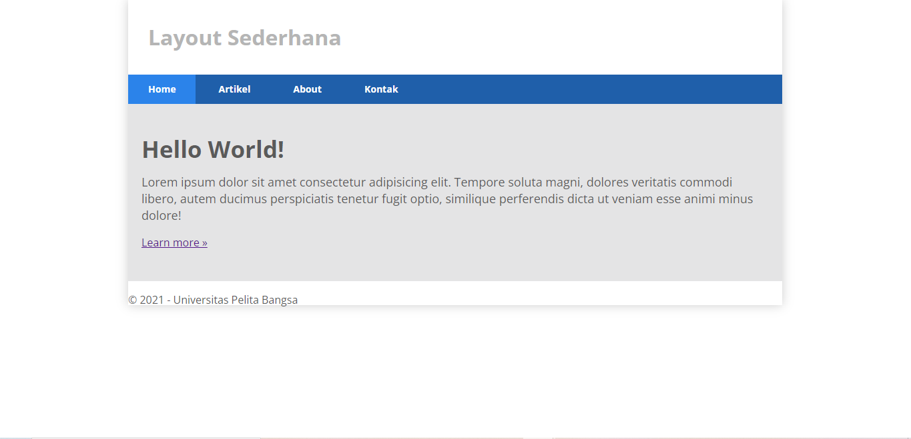

### 5. Mengatur Layout Main dan Sidebar
```css
/* main content */
#wrapper {
    margin: 0;
}
#main {
    float: left;
    width: 640px;
    padding: 20px;
}
/* sidebar area */
#sidebar {
    float: left;
    width: 260px;
    padding: 20px;
}
```
### 6. Membuat Sidebar Widget
```html
<aside id="sidebar">
    <div class="widget-box">
        <h3 class="title">Widget Header</h3>
        <ul>
            <li><a href="#">Widget Link</a></li>
            <li><a href="#">Widget Link</a></li>
            <li><a href="#">Widget Link</a></li>
            <li><a href="#">Widget Link</a></li>
            <li><a href="#">Widget Link</a></li>
        </ul>
    </div>
    <div class="widget-box">
        <h3 class="title">Widget Text</h3>
        <p>Lorem ipsum dolor sit, amet consectetur adipisicing elit. Id, accusantium. In, ipsam perferendis, odio delectus nihil iure veritatis aliquam nulla amet quas suscipit distinctio facilis veniam voluptas expedita quaerat blanditiis.</p>
    </div>
 </aside>
 ```
 #### Kemudian tambahkan CSS
 ```css
 /* widget */
.widget-box {
    border: 1px solid #eee;
    margin-bottom: 20px;
}
.widget-box  .title {
    padding: 10px 16px;
    background-color: #428bca;
    color: #fff;
}
.widget-box ul {
    list-style-type: none;
}
.widget-box li {
    border-bottom: 1px solid #eee;
}
.widget-box li a {
    padding: 10px 16px;
    color: #333;
    display: block;
    text-decoration: none;
}
.widget-box li:hover a {
    background-color: #eee;
}
.widget-box p {
    padding: 15px;
    line-height: 25px;
}
```

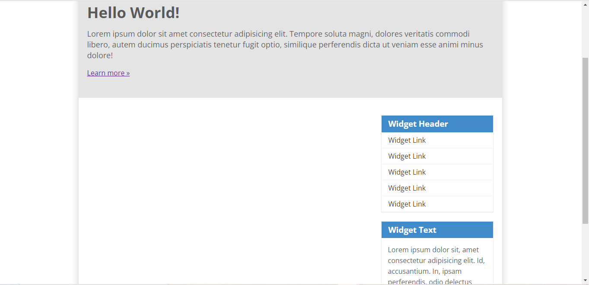

### 7. Mengatur Footer
```css
/* footer */
footer {
    clear: both;
    background-color: #1d1d1d;
    padding: 20px;
    color: #eee;
}
```

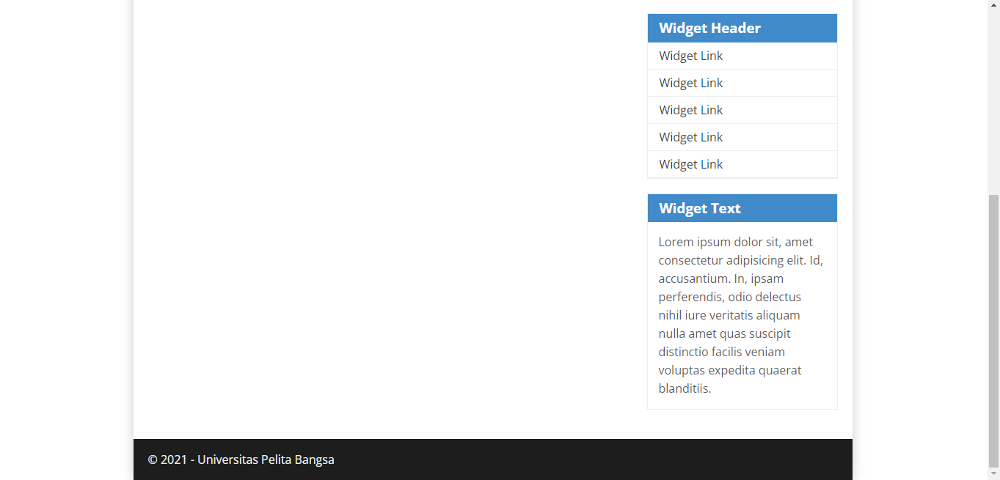

### 8. Menambahkan Elemen lainnya pada Main Content
```html
<section id="main">
    <div class="row">
        <div class="box">
            
            <h3>Heading</h3>
            <p>Donec sed odio dui. Etiam porta sem malesuada magna mollis euismod.</p>
            <a href="#" class="btn btn-default">View detail</a>
        </div>
        <div class="box">
            
            <h3>Heading</h3>
            <p>Donec sed odio dui. Etiam porta sem malesuada magna mollis euismod.</p>
            <a href="#" class="btn btn-default">View detail</a>
        </div>
        <div class="box">
            
            <h3>Heading</h3>
            <p>Donec sed odio dui. Etiam porta sem malesuada magna mollis euismod.</p>
            <a href="#" class="btn btn-default">View detail</a>
        </div>
    </div>
</section>
```
#### Kemudian tambahkan CSS
```css
/* box */
.box {
    display: block;
    float: left;
    width: 33.333333%;
    box-sizing: border-box;
    -moz-box-sizing: border-box;
    -webkit-box-sizing: border-box;
    padding: 0 10px;
    text-align: center;
}
.box h3 {
    margin: 15px 0;
}
.box p {
    line-height: 20px;
    font-size: 14px;
    margin-bottom: 15px;
}
box img {
    border: 0;
    vertical-align: middle;
}
.image-circle {
    border-radius: 50px;
}
.row {
    margin: 0 -10px;
    box-sizing: border-box;
    -moz-box-sizing:border-box;
    -webkit-box-sizing:border-box;
}
.row:after, .row:before,
.entry:after, .entry:before {
    content: '';
    display: table;
}
.row:after,
.entry:after {
    clear: both;
}
```

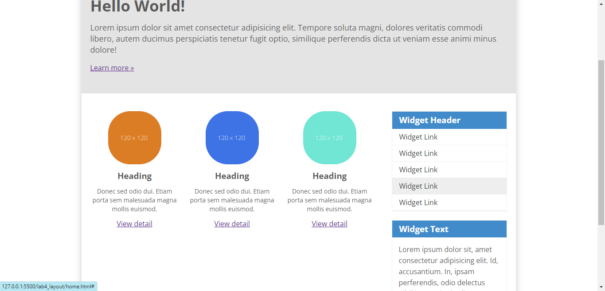

### 9. Menambahkan Content Artikel
```html
<hr class="divider" />
<article class="entry">
    <h2>First featurette heading.</h2>
    
    <p>Lorem ipsum, dolor sit amet consectetur adipisicing elit. Nisi eligendi est iste consequuntur autem inventore perspiciatis velit accusantium tempora reprehenderit quasi molestias porro alias sint placeat, maxime, id voluptas voluptatibus!.</p>
</article>
<hr class="divider" />
<article class="entry">
    <h2>First featurette heading.</h2>
    
    <p>Lorem, ipsum dolor sit amet consectetur adipisicing elit. Illum provident maiores necessitatibus quam quisquam commodi, officiis ipsa inventore animi quae qui id nisi autem consequatur itaque dolorum ut corrupti eligendi.</p>
</article>
```
#### Kemudian tambahkan CSS
```css
.divider {
    border: 0;
    border-top: 1px solid #eeeeee;
    margin: 40px;
}
/* entry */
.entry {
    margin: 15px 0;
}
.entry h2 {
    margin-bottom: 20px;
}
.entry p {
    line-height: 25px;
}
.entry img {
    float: left;
    border-radius: 5px;
    margin-right: 15px;
}
.entry .right-img {
    float: right;
}
```

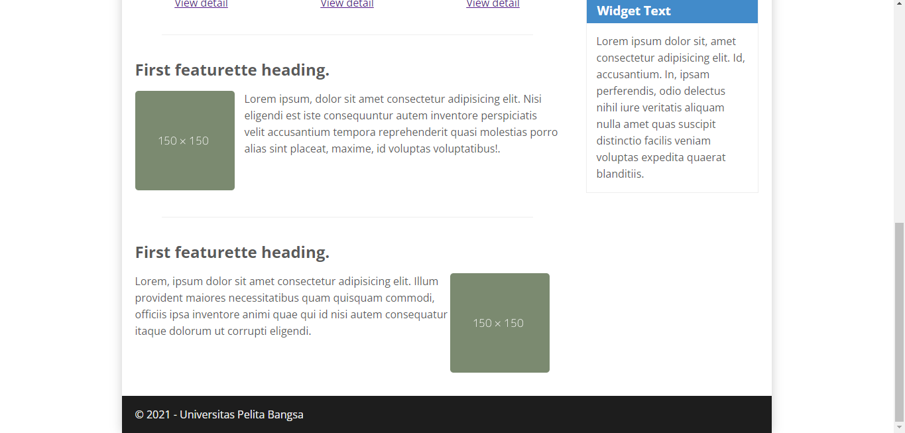

## PERTANYAAN DAN TUGAS!

## 1). TAMBAHKAN LAYOUT UNTUK MENU ABOUT
##     => BUAT SINGLE LAYOUT YANG BERISI DESKRIPSI,PORTOFOLIO,DLL

## CONTOH CODE DAN TAMPILAN BROWSER NYA!
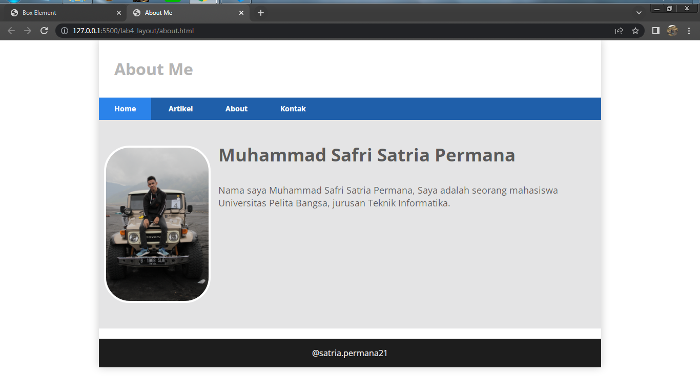

**PENJELASAN**

Gambar di atas adalah contoh dalam membuat **ABOUT** dengan nama fila html nya yaitu ***about.html** dan terhubung langsung melalui link dengan **Home** dan saya juga menggunakan beberap **style.css** eksternal yang tersedia
**code html**
```html
<!DOCTYPE html>
<html lang="en">
<head>
    <meta charset="UTF-8">
    <meta http-equiv="X-UA-Compatible" content="IE=edge">
    <meta name="viewport" content="width=device-width, initial-scale=1.0">
    <title>About Me</title>
    <link rel="stylesheet" href="style.css">
</head>
<body>
    <div id="container">
        <header>
            <h1>About Me</h1>
        </header>
        <nav>
            <a href="home.html" class="active">Home</a>
            <a href="artikel.html">Artikel</a>
            <a href="about.html">About</a>
            <a href="kontak.html">Kontak</a>
        </nav>
        <section id="about">
            <div class="row">
                
                <h1>Muhammad Safri Satria Permana</h1>
                <p>Nama saya Muhammad Safri Satria Permana, Saya adalah seorang mahasiswa Universitas Pelita Bangsa, jurusan Teknik Informatika.</p>
            </div>
        </section>
        <footer>
            <p style="text-align: center;">@satria.permana21</p>
        </footer>
    </div>
</body>
</html>
```
**code css**
```css
/* About Panel */
#about{
    background-color: #e4e4e5;
    padding: 50px 20px;
    margin-bottom: 20px;
}
#about h1{
    margin-bottom: 10px;
    font-size: 35px;
    position: relative;
    left: 15px;
}
#about p{
    margin-bottom: 20px;
    font-size: 18px;
    padding: 30px;
    line-height: 25px;
    position: relative;
    left: 15px;
```
## 2). TAMBAHKAN LAYOUT YANG BERISI UNTUK MENU CONTACT
##     => YANG BERISI FORM ISIAN: NAMA,EMAIL,MESSAGE,DLL
* Buat file HTML baru dengan nama **kontak.html** dan buat form yang berisi: nama,email,message,dll.
## CONTOH CODE DAN TAMPILAN BROWSER NYA!
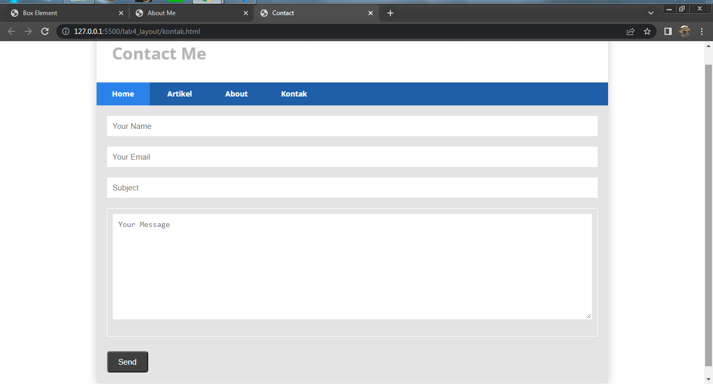
**PENJELASAN**
Disini saya membuat contact dengan beberapa file html dan sedikit menggunakan css eksternal,seperti contoh gambar di atas.
**code html**
```html
<!DOCTYPE html>
<html lang="en">
<head>
    <meta charset="UTF-8">
    <meta http-equiv="X-UA-Compatible" content="IE=edge">
    <meta name="viewport" content="width=device-width, initial-scale=1.0">
    <title>Contact</title>
    <link rel="stylesheet" href="style.css">
</head>
<body>
    <div id="container">
        <header>
            <h1>Contact Me</h1>
        </header>
        <nav>
            <a href="home.html" class="active">Home</a>
            <a href="artikel.html">Artikel</a>
            <a href="about.html">About</a>
            <a href="kontak.html">Kontak</a>
        </nav>
        <section id="kontak">
            <div class="login">
               <input type="text" placeholder="Your Name" class="input">
               <input type="text" placeholder="Your Email" class="input">
            </div>
            <div class="subject">
                <input type="text" placeholder="Subject" class="input"> 
            </div>
            <div class="msg">
                <textarea name="Message" id="Message" cols="35" rows="10" class="area" class="input" placeholder="Your Message"></textarea>
            </div>
            <button type="submit">Send</button>
        </section>
    </div>
</body>
</html>
```
**code css**
```css
/* Kontak Panel */
#kontak{
    background-color: #e4e4e5;
    padding: 20px 20px;
    margin-bottom: 20px;
}
.input,
.msg, .area{
    width: 100%;
    padding: 10px;
    border: 1px solid white;
    box-sizing: border-box;
    font-size: 15px;
    margin-bottom: 20px;
    
}
button{
    font-size: 15px;
    background-color: #3f3f3f;
    color: white;
    border-radius: 5px;
    padding: 10px 20px;
    margin-top: 8px;
}
button:hover{
    opacity: 0,9;
    background-color: #1f5faa;
}
```
satriapermana